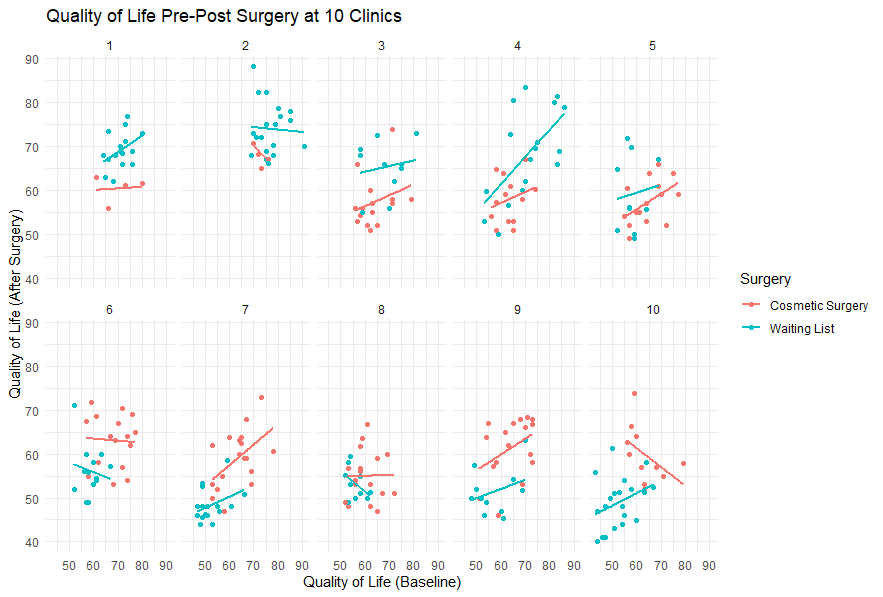

This contains codes and data I've used while learning multivariate data analysis
with 
<a href="https://scholar.google.co.uk/citations?user=0Iy7PFYAAAAJ&hl=en" target="_blank">Andy Field</a>'s
<a href="https://studysites.sagepub.com/dsur/study/default.htm" target= "_blank">*Discovering Statistics Using R*</a>
(DSUR)
excellent book. All of the codes to Andy's book can be found
<a href="https://studysites.sagepub.com/dsur/study/scriptfi.htm" target="_blank">here</a>.

As was said, codes to the book are already freely available.
This is not a copy of the book or its scripts. Although most codes used 
came from the book:

* Packages that are already in disuse were here updated (example: *WRS* was
updated to *WRS2*).
* *tidyverse* syntaxes are employed.
* *S4* syntaxes are employed.
* Code is uniformly formatted (examples: data.frame object in use is generally
referred as *df*, robust tests are separated from non-robust procedures).
* Syntaxes' organization is different to facilitate *my own understanding*.
This means that subjects are treated in the order I better see fit.

Most of the time, especially in the later chapters, direct quotations from the
book are shown. They're easily recognizable due to their size and the *#'* 
notation. This is used to preserve Andy's interpretation of the results.

Furthermore, this repo has the following structure:

* <a href="http://github.com/GabrielReisR/dsur_exercises/tree/master/Data%20Files/" target="_blank">**Data Files**</a>:
this folder contains all of (or most of) the data files used in Andy Field's book.
The whole list of data files, by chapters, can be found
<a href="https://studysites.sagepub.com/dsur/study/articles.htm" target="_blank">here</a>.
What I've done is put the ones I use in the syntaxes in this one folder.

* <a href="http://github.com/GabrielReisR/dsur_exercises/tree/master/Scripts/" target="_blank">**Scripts**</a>:
syntaxes by chapter. Some chapters are divided in more than one part to aid my
own understanding of the code. All scripts I deemed useful and/or relevant were
put here. Just as before, and as already mentioned, DSUR's site already has
script files divided by chapter: they can be found
<a href="https://studysites.sagepub.com/dsur/study/scriptfi.htm" target="_blank">here</a>.
The ones used here were not copied from these scripts and are in fact *very* 
different from those.

Below is a plot made for the final chapter of the book. Hope this helps!

