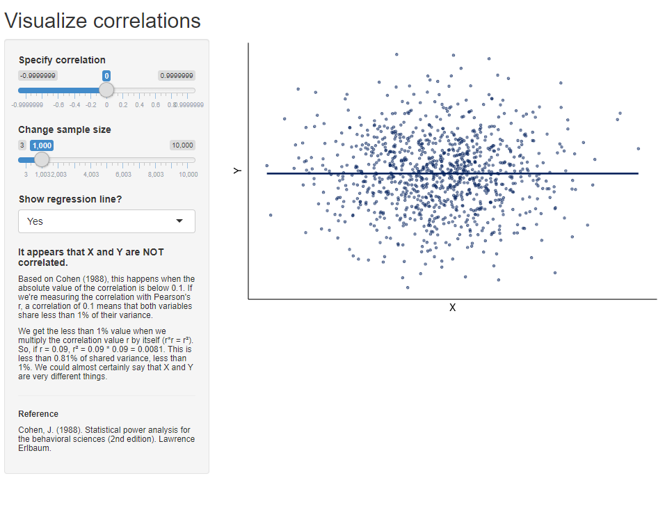

A simple app to visualize correlations.

You can:

* Change sample size
* Change the estimated correlations between X and Y
* Choose to show or hide the regression line

The goal of the app is to help students grasp the correlation concept in a more
intuitive way. Some interpretation guidelines based on Cohen (1988) are 
suggested according to the correlation strenght.

