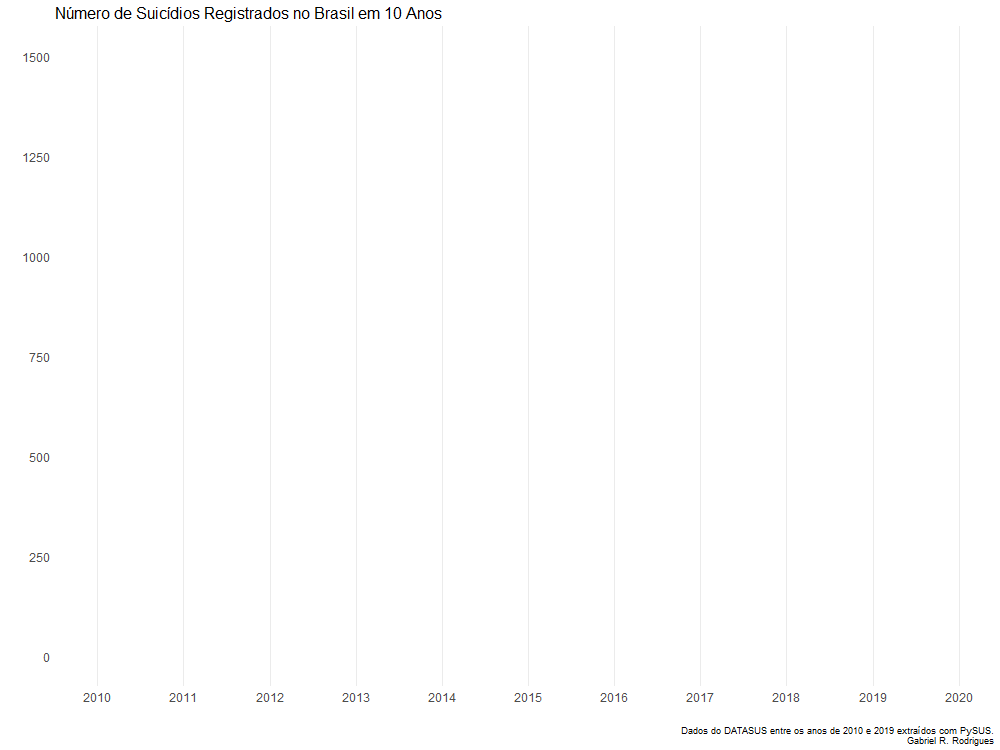

This is a full analyses of the number of suicides in Brazil ranging from 2010
to 2019. Data were collected and cleaned from DATASUS using the PySUS library 
from Python. Visualizations and descriptive statistics were obtained using R
(specially the ggplot2, dplyr, tidyr, and psych packages). A machine learning
procedure was at last implemented aiming to predict the number of nationwide 
suicides per month using few economic variables. On the machine learning
procedure, the final neural network model achieved Mean Absolute Error = 0.3135.

Key questions asked were:
1. How many suicides occured by year? And by month? Was there any noticeable 
uptrend or downtrend throughout the years?
2. Who commited suicide? Age, sex, race, occupation and other demographics were 
explored.
3. Where did suicide occur? Where were suicides more common and which Brazilian
states had higher reports of suicide?
